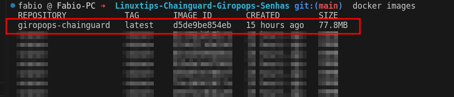
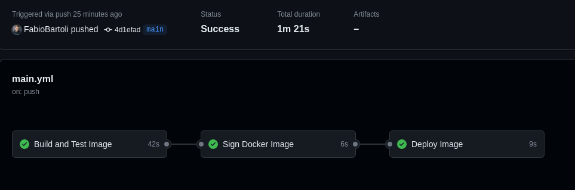
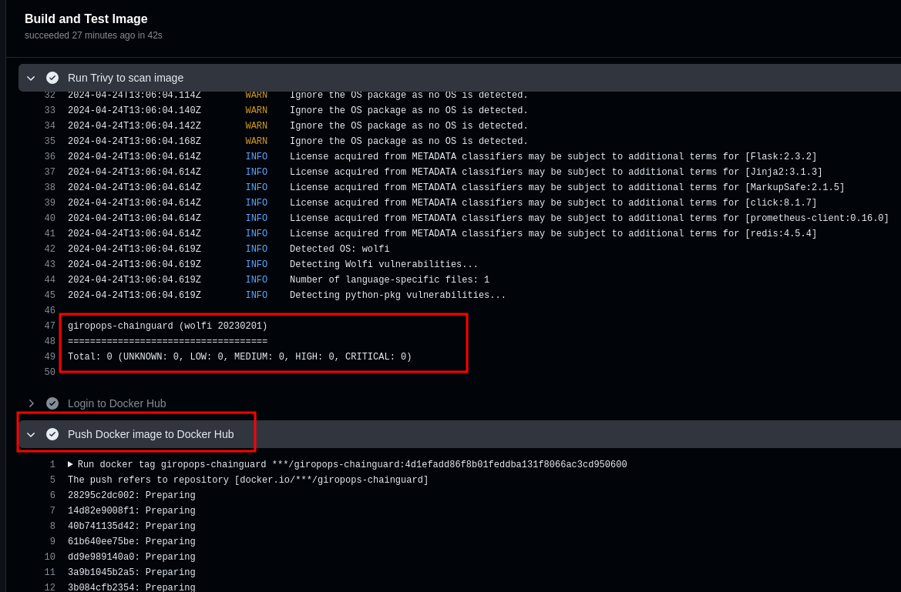
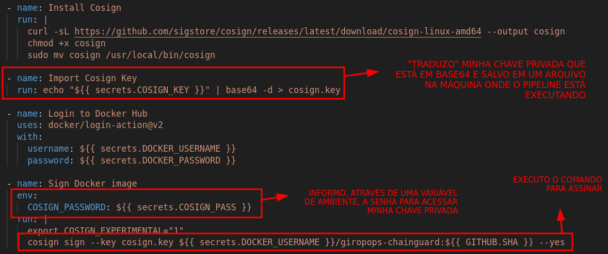
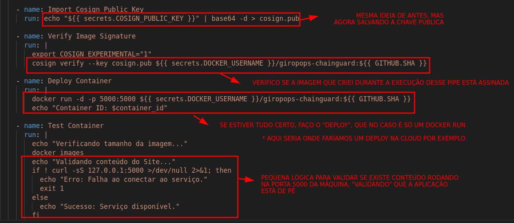

## Desafio Day 03 - Criando o Distroless
Para resolver o desafio do dia 03, eu optei por tentar uma abordagem onde utilizasse um container único para o build da aplicação completa, com a estrutura do Python e do Redis executando em um container mínimo
A primeira questão a ser resolvida é o entrypoint: Eu preciso de uma maneira de executar tanto o redis em daemon quanto o python/flask para iniciar a aplicação, mas não podemos ter mais de um ENTRYPOINT a ser executado para inicializar o container. Também não poderíamos executar comandos internamente na última camada da aplicação, pois a imagem de produção da Chainguard não contempla a execução de bash, shell ou afins. A solução para isso foi desenvolver uma pequena aplicação binária GO, que pode ser conferida em ./app/go-bin-exec/main.go
#
Com o código do GO criado, preciso analisar quais serão os steps necessários para meu Dockerfile gerar a imagem corretamente, e optei por utilizar 3 stages anteriores ao build da aplicação. São eles:

 - python-builder: Onde faço a instalação dos requirements para a aplicação utilizando a imagem do python-dev da Chainguard
 - redis-builder: Utilizo a imagem redis da Chainguard apenas para ter o binário do redis disponível
 - go-builder: Onde vou realizar o build da aplicação que criei em go anteriormente

Feito a criação dos stages, irei copiar os executáveis necessários gerados por cada uma das partes para a minha imagem final:

    COPY  --from=python-builder  /home/nonroot/.local/lib/python3.12/site-packages  /home/nonroot/.local/lib/python3.12/site-packages
    COPY  --from=python-builder  /home/nonroot/.local/bin  /home/nonroot/.local/bin
    COPY  --from=redis-builder  /usr/bin/redis-server  /usr/bin/redis-server
    COPY  --from=go-builder  /app/go-bin-exec  .
O Dockerfile completo pode ser conferido em ./app/Dockerfile
Por fim, a aplicação foi totalmente buildada em uma imagem final de 78MB

## Verificando as Vulnerabilidades e Assinatura da Imagem
Para os passos a seguir, criei um pipeline automatizado do Github Actions para simular o que poderia ocorrer em um ambiente real, onde criamos uma imagem e submetemos a um Pipeline CI/CD antes de publicar essa imagem em produção

O Actions completo poderá ser conferido em ./.github/workflows/main.yml, mas aqui está um resumo do que ele está fazendo:

 - **Build and Test Image**: Esse primeiro job é o responsável por fazer o build da Imagem em si, além de testá-la utilizando o trivy. Se nenhuma vulnerabilidade é descoberta, ele segue para fazer o push da minha imagem no meu dockerhub
Aqui, eu optei por utilizar o meu SHA do commit do Github como minha tag, para que eu consiga ter um controle melhor de versão

 - **Sign Docker Image**: Aqui, eu vou realizar a assinatura da imagem que eu acabei de subir no meu Dockerhub no step anterior. Para isso, além de instalar o cosign na máquina que está executando meu pipeline, vou utilizar a chave privada que criei previamente em meu computador e armazenei como uma secret no Github em base64 "secrets.COSIGN_KEY". Também preciso informar qual é a senha para poder acessar minha chave privada, senha esta que armazenei na minha secret "secrets.COSIGN_PASS". Utilizo a flag "--yes" no final do comando do cosign para que ele não peça ao usuário para confirmar a criação da assinatura, o que quebraria meu deploy automatizado
 

 
 - **Deploy Image**: Por fim, esse step é onde simulo o que aconteceria depois da imagem estar "pronta para ir para produção". Aqui, estou verificando a assinatura da imagem e, se ela for válida, faço o deploy do container utilizando ela. Após o deploy, verifico se a imagem está executando e se o serviço está disponível
 Em um ambiente real, esses dois últimos steps de deploy do container e healthcheck não seriam feitos diretamente aqui no Github, mas sim no Cloud Provider que estamos utilizando, mas aqui podemos ter uma ideia básica de funcionando

#### Qualquer dúvida ou sugestão, estou à disposição! >> [Telegram](https://t.me/FabioBartoli) <<
